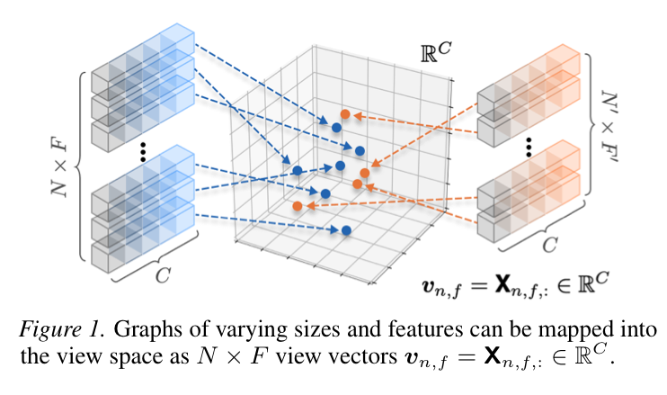
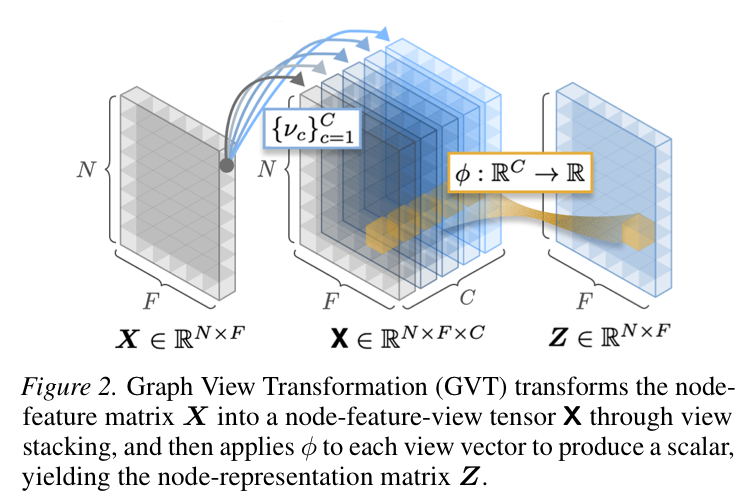

# View Space: Learning Representation across Arbitrary Graphs

This repository is the official implementation of **[View Space: Learning Representation across Arbitrary Graphs](https://arxiv.org/abs/2512.11561)**. It provides **Graph View Transformation (GVT)** and its recurrent encoder, **Recurrent GVT (RGVT)**, for fully inductive node representation learning across graph datasets with heterogeneous feature spaces.

The paper studies **fully inductive node representation learning (FI-NRL)**: a shared graph encoder should map arbitrary unseen graphs to useful node representations even when the number of nodes, graph structure, feature dimensionality, and feature semantics differ from the pretraining graph. RGVT is pretrained on OGBN-Arxiv and then applied to transfer benchmarks with the encoder frozen. Only a lightweight dataset-specific predictor is trained during adaptation.

## Method Overview

<table>
  <tr>
    <td width="50%" align="center" valign="middle">
      
    </td>
    <td width="50%" align="center" valign="middle">
      
    </td>
  </tr>
</table>

- **View space:** A graph-induced representation axis created by stacking multiple propagated versions of the node-feature matrix. Each node-feature pair is represented by a fixed-dimensional view vector.
- **View finders:** The implementation uses the identity view plus powers of row-normalized and symmetric-normalized adjacency matrices.
- **Graph View Transformation (GVT):** A shared MLP maps each view vector to a scalar, producing a transformed node-feature matrix while preserving node- and feature-permutation equivariance.
- **Recurrent GVT (RGVT):** A single nonlinear GVT is applied recurrently with shared parameters. The recurrent depth can be selected per dataset without retraining the encoder.
- **Adaptation:** For each target graph, RGVT is frozen. The code trains a lightweight linear or one-hidden-layer MLP predictor on RGVT representations and selects the recurrent depth by validation accuracy.

## Repository Pipeline

The entry point is [main.py](/Users/dooho/Desktop/02.Writing/Codes/view-space/main.py).

1. **Stage 1: pretraining**
   Train RGVT and a predictor jointly on the source graph, OGBN-Arxiv by default, and save the best RGVT encoder checkpoint.

2. **Stage 2: adaptation and evaluation**
   Load the frozen RGVT checkpoint, generate representations at recurrent depths `L = 1...max_depth`, train only the lightweight predictor for each depth, select the best depth by validation accuracy, and report test accuracy.

## Datasets

The dataset registry in [load_dataset.py](/Users/dooho/Desktop/02.Writing/Codes/view-space/load_dataset.py) contains **28 node-classification datasets in total**:

- **1 pretraining/source dataset:** OGBN-Arxiv.
- **27 transfer benchmarks:** heterophilous, citation, coauthor, Amazon, airport, social, wiki, and other graph datasets with diverse feature specifications.

In the paper's experimental setup, RGVT is pretrained on OGBN-Arxiv and evaluated for transfer on 27 downstream benchmarks. The current adaptation loop iterates over all registered datasets, so result summaries include 28 total datasets when OGBN-Arxiv is included.

## Quick Start

### Environment setup

Create the Conda environment from the provided portable environment file:

```bash
conda env create -f environment.yml
conda activate graph_view_space
```

The environment installs the CUDA 12.1 PyTorch, DGL, and PyG wheels used by this repository, along with the data and experiment dependencies such as OGB, scikit-learn, pandas, matplotlib, and Weights & Biases.

### Full pipeline with an MLP predictor

```bash
python main.py \
  --mode both \
  --datasetA 27_ogbn_arxiv \
  --checkpoint checkpoints/mlp/seed_42.pth \
  --learning_rate 0.005 \
  --predictor_type mlp
```

### Pretrain RGVT on OGBN-Arxiv

```bash
python main.py \
  --mode pretrain \
  --datasetA 27_ogbn_arxiv \
  --checkpoint checkpoints/mlp/seed_42.pth \
  --learning_rate 0.005 \
  --predictor_type mlp
```

### Adapt a pretrained RGVT checkpoint

```bash
python main.py \
  --mode adaptation \
  --datasetA 27_ogbn_arxiv \
  --checkpoint checkpoints/mlp/seed_42.pth \
  --learning_rate 0.005 \
  --predictor_type mlp
```

The provided scripts run the same MLP setting:

- [scripts/both_rgvt_mlp.sh](/Users/dooho/Desktop/02.Writing/Codes/view-space/scripts/both_rgvt_mlp.sh): pretraining followed by adaptation.
- [scripts/adapt_rgvt_mlp.sh](/Users/dooho/Desktop/02.Writing/Codes/view-space/scripts/adapt_rgvt_mlp.sh): adaptation only, assuming the checkpoint already exists.

## Citation

If you use this code, please cite:

```bibtex
@misc{lee2026viewspace,
      title={View Space: Learning Representation across Arbitrary Graphs},
      author={Dooho Lee and Myeong Kong and Minho Jeong and Jaemin Yoo},
      year={2026},
      eprint={2512.11561},
      archivePrefix={arXiv},
      primaryClass={cs.LG},
      url={https://arxiv.org/abs/2512.11561},
}
```

## Contact

For questions or feedback, please open an issue in this repository or contact dooho@kaist.ac.kr.
